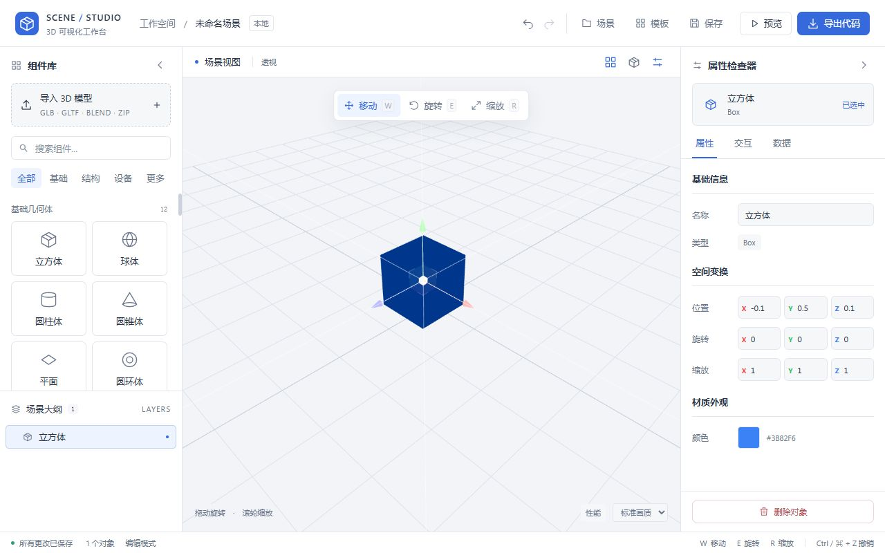

# Vue-Blender LowCode

Vue 3、Pinia、TresJS 构建的 3D 场景编辑器，Express 提供 Blender 转换接口。



## 运行

需要 Node.js 22.12 或以上。只导入 GLB 或自包含 GLTF 时不需要 Blender；转换 .blend 时需要安装 Blender。

```powershell
npm run install:all
npm run dev
```

前端默认端口 5173，后端默认端口 3000。前端开发服务器将 /api 和 /models 转发到后端。
可以分别运行 `npm run dev:frontend`、`npm run dev:backend`。`node backend/server.js` 仍兼容，但统一使用 backend/src/app.js。

可选环境变量：

- `BLENDER_PATH`：Blender 可执行文件路径；Windows 下会尝试 Program Files 中的安装位置，其他情况使用 PATH。
- `PORT`：后端端口；调整后也需修改开发代理目标。
- `MODEL_DIR`、`UPLOAD_DIR`：服务端资产和临时文件目录。
- `VITE_API_BASE_URL`：前端访问独立后端的地址；生产部署可使用同源反向代理 /api、/models。

## 保存与导出

- 场景数据存入 localStorage，模型二进制存入 IndexedDB。同一浏览器、同一站点地址下刷新可恢复。
- GLTF 使用外部贴图或 .bin 时，可以多选模型和依赖文件；有复杂目录结构时上传完整 ZIP。
- “场景 → 导出到文件”生成包含模型数据的 JSON；可在另一浏览器中导入。
- “导出代码”生成项目 ZIP，包含场景 JSON、共享渲染/交互代码、模型和 Draco 解码器。解压后 `npm install`、`npm run dev`；使用 `npm run build` 生成发布文件。
- 自动保存覆盖属性修改和空场景，延迟约 1.5 秒，持续变更时最多约 5 秒保存一次。页面顶部显示保存状态。
- 浏览器清理站点数据会同时清理本地场景和模型；需要长期备份时请导出场景 JSON。
- 可读取旧版 v2 场景。旧版本已经丢失的组合组件数据、已失效的 blob URL 无法自动恢复，需要重新导入。旧后端的 /models 地址仍尽量兼容。

## 验证

```powershell
npm test
npm run build:frontend
npm run test:export
```

测试覆盖所有内置组合组件和模板的保存恢复、自动保存、无效导入保护、IndexedDB 资产、GLTF 依赖、便携场景文件、项目资产打包，以及后端上传和 ZIP 资源路径。
`test:export` 在系统临时目录生成并构建一个独立导出项目，包含组合组件、文字、交互和模型；使用本地安装的依赖进行构建验证。

## 编辑、预览与撤销

- 顶部“撤销 / 重做”，快捷键 Ctrl/Cmd+Z、Ctrl/Cmd+Shift+Z 或 Ctrl+Y；在输入框中保留原生文本撤销。连续输入、滑块调整及一次手柄拖拽会合并为一条记录。
- 支持对象增删、属性/交互/绑定/组合参数修改，以及模板替换、场景加载和导入。记录仅在本次会话内保留，最多 100 步，并限制快照总量约 16 MiB；模型二进制不复制进历史记录。
- 编辑模式只配置对象；“预览”在独立副本上运行动画、点击/悬停和数据绑定。返回编辑丢弃预览结果，自动保存与项目导出始终使用原始编辑文档。
- 左下角可选择流畅、标准、精细画质，控制像素比和曲面细分；旁边显示绘制次数、三角形、几何体与纹理数量，方便比较大型场景的开销。

## 转换任务

前端直接导入 GLB/GLTF；Blend/ZIP 走异步任务接口，显示真实上传百分比及排队、解压、转换、校验阶段。Blender 没有可靠的总进度，因此转换阶段显示阶段文字。点击“取消导入”会中止上传/下载并取消服务端任务。

- `POST /api/convert/jobs/:id`：multipart `modelFile`，ID 使用 UUID，返回 202。
- `GET /api/convert/jobs/:id`：返回状态、阶段、错误或结果 URL。
- `DELETE /api/convert/jobs/:id`：取消排队/执行中的任务；完成后的任务保持结果。
- 旧 `POST /api/convert` 仍兼容，并共用队列。默认单任务执行，最多 12 个未完成任务，超限返回 429；Blender 超时 120 秒。
- 终态记录保留 30 分钟，服务重启不恢复任务。临时上传及失败/取消的输出自动清理；成功模型作为持久资产保留。该队列针对本地部署，未实现登录、租户配额或分布式恢复。

## 代码扩展与资源管理

- `frontend/src/types/scene.d.ts` 描述场景文档、对象、绑定、交互与转换任务类型；`utils/sceneDocument.js` 负责 v2/v3 验证、序列化和恢复。
- `config/componentRegistry.js` 统一原子组件的默认值、库展示信息、渲染定义、光源参数和画质参数。新增普通几何体只需在这里注册，工厂、画布、验证和导出共同使用。
- `config/componentLibrary.js` 定义组合组件预设及生成器；`config/componentParameters.js` 提供参数编辑规则和稳定子对象 ID。
- `composables/useSceneRuntime.js` 是编辑器预览和导出项目共同入口；`runtime/frameScheduler.js` 为自动旋转、补间、绑定及模型动画共用一个帧调度器。无活动任务不请求帧，隐藏页面暂停，数据绑定最多 10 Hz，时钟文字只在内容变化时更新。
- 模型加载器、模板与弹窗、导出代码按需加载。模型卸载时释放 Mixer、材质、几何体、纹理和临时 URL；文字复用 Canvas/纹理，尺寸变化时替换并释放。变换控件在卸载前显式释放其辅助几何体和监听器。
- 已保存场景和撤销记录可能继续引用 IndexedDB 模型，因此删除场景中的对象不会立即删除本地模型字节。

本阶段验证记录见 [docs/phase23-verification.md](docs/phase23-verification.md)。

## 界面与导航

- 组件库支持按名称、类型、描述搜索，以及基础/结构/设备/更多分类筛选；点击组件或拖入画布添加。
- 场景大纲支持折叠组合对象；属性检查器分为“属性 / 交互 / 数据”三个标签，左右方向键可切换。
- 画布右上角可切换侧栏、重置视角；左下角显示操作提示，右下角可调整画质、展开性能数据。保存状态与对象数量集中显示在底部。
- 960px 以下侧栏使用抽屉布局；对话框支持 Esc 关闭、Tab 焦点循环，关闭后返回原操作按钮。
- 界面统一主题位于 `frontend/src/styles/editor.css`，SVG 图标位于 `components/common/AppIcon.vue`，无需额外图标或字体依赖。

本轮浏览器检查覆盖 1280px、900px、390px 窗口，以及搜索添加、标签键盘导航、撤销、弹窗关闭；前后端 19 项测试、生产构建和独立项目导出构建均通过。
