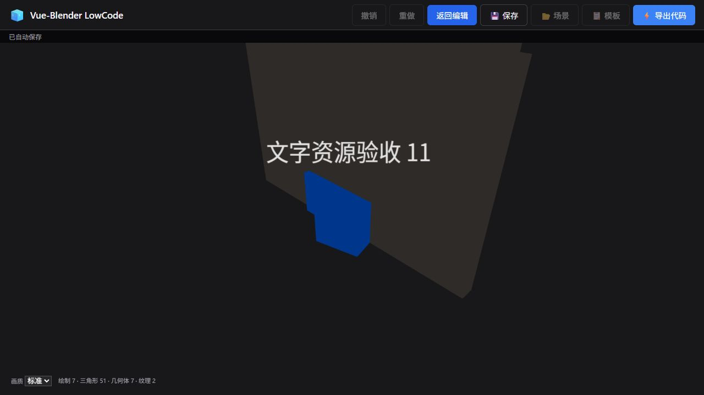

# 第二、第三阶段验收记录

日期：2026-10-01。环境：Windows、Node.js、Blender 4.5、Vue 3.5、TresJS Core 5.8.1 / Cientos 5.7.2、Three.js 0.184。

## 已实现

- 集中组件注册表、参数编辑规则、场景类型声明；编辑器和导出项目共享渲染节点、交互、数据绑定及帧调度器。
- 支持对象、属性、组合参数、模板、场景加载/导入的撤销重做；连续编辑与手柄拖动合并，历史上限 100 步/约 16 MiB。
- 编辑/预览隔离，预览使用独立副本，编辑场景和自动保存不受运行时改变影响。
- 上传百分比、后台阶段状态、排队及取消；旧接口共用单并发队列，最多 12 个未完成任务。
- 统一活动帧调度，隐藏页面暂停，绑定以 10 Hz 更新；静态模型不运行 Mixer 循环。
- 异步加载模型组件、弹窗、模板和导出代码；文字 Canvas/纹理复用，模型卸载释放资源。
- 修复 Cientos 变换手柄卸载时的几何体泄漏，使用其正确的 dragging 事件提交拖拽历史。
- 三档画质与实时渲染资源计数。

## 自动验证

| 验证 | 结果 |
|---|---|
| `npm test` | 前端 16、后端 3，全部通过，无跳过 |
| `npm run build:frontend` | 通过 |
| `npm run test:export` | 独立项目构建通过 |
| 真实 Blender | 动画和网格转换通过；执行中 AbortSignal 取消通过，临时目录及未完成输出清理通过 |
| 转换 HTTP | 新任务接口成功、旧接口兼容、GLTF ZIP 依赖保留、中途断开上传无临时文件残留 |
| 队列 | 单并发、队列上限、取消排队和执行中的任务、失败状态、取消后晚到上传清理通过 |
| 编辑历史 | 手势合并、增删/参数恢复、分支重做失效、场景替换、内存上限通过 |
| 运行时 | 共享帧、空闲停止、后台暂停、取消订阅、预览隔离、补间和绑定通过 |

## 浏览器验收

使用本地 5183 编辑器及 5184 导出项目进行实际操作：

1. 添加方块，修改名称，撤销后恢复原名，重做后恢复新名。
2. 进入预览后编辑面板与变换工具隐藏；返回后原始旋转值仍为 0，自动旋转只作用于预览。
3. 修复前，每次切换预览并重新选中对象会增加约 20 个几何体；修复后连续五次往返可回落到测试场景本身的 6 个几何体、1 个纹理，选中时临时增加的手柄资源会释放。
4. 同一文字对象连续修改 12 次后仍为 2 个纹理（包含渲染器原有纹理），删除文字后回落到 1 个。
5. 上传 triangle.zip，看到可取消加载界面，后台完成后模型进入场景并保存到 IndexedDB。
6. 独立导出项目实际显示组合展台、模型及带引号/换行的文字，控制台无警告或错误。
7. 清除本次添加的验收对象，恢复测试前的场景内容。

## 性能与边界

- 主 JS 从初次审阅的 1,242.61 kB / gzip 349.47 kB 降至 1,124.12 kB / gzip 319.72 kB；模型加载器、模板、导出运行时代码等已分成按需块。仍有主块超过 500 kB 的构建提示，未声称消除 Three.js 的基础下载开销。
- 流畅球体使用 12 段、精细球体 32 段；测试验证流畅三角形数量小于精细档的四分之一。实际帧率依赖 GPU、模型与场景，未作普遍 FPS 承诺。
- 资源计数来自实际循环验收，未进行数小时连续压力测试。
- 历史和转换任务状态均在内存中；刷新/服务重启不恢复历史/任务。成功的模型资产保留，避免破坏已保存场景和撤销引用。
- 场景类型声明为关键数据契约，未将现有 Vue/JavaScript 工程全量迁移为 TypeScript。
